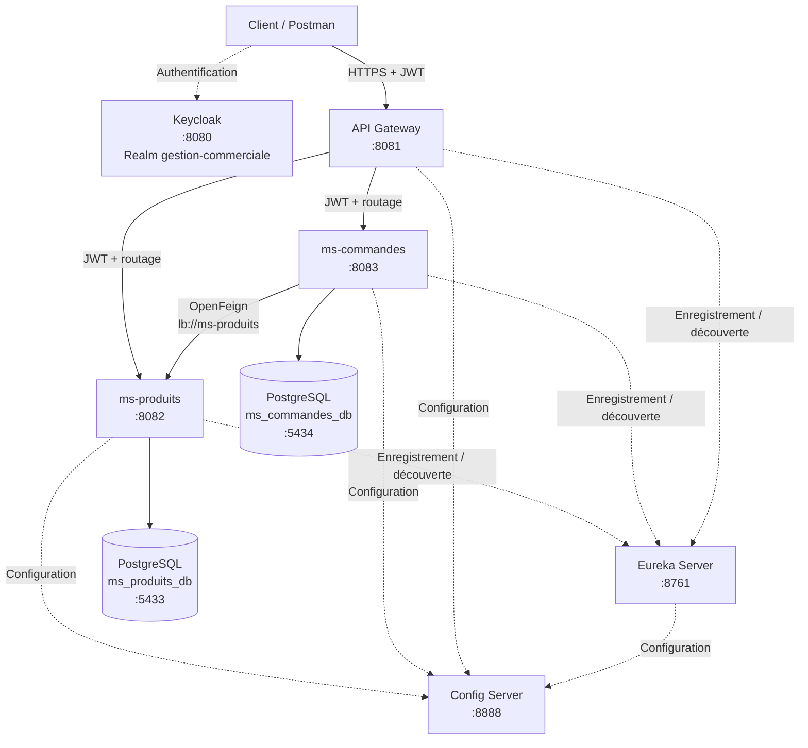

# Diagramme d'architecture — Microservices

```mermaid
flowchart TB
    Client["Client / Postman"]

    KC["Keycloak<br/>:8080<br/>Realm gestion-commerciale"]
    GW["API Gateway<br/>:8081"]
    CFG["Config Server<br/>:8888"]
    EUR["Eureka Server<br/>:8761"]

    MP["ms-produits<br/>:8082"]
    MC["ms-commandes<br/>:8083"]

    DBP[("PostgreSQL<br/>ms_produits_db<br/>:5433")]
    DBC[("PostgreSQL<br/>ms_commandes_db<br/>:5434")]

    Client -->|"HTTPS + JWT"| GW
    Client -.->|"Authentification"| KC
    GW -->|"JWT + routage"| MP
    GW -->|"JWT + routage"| MC

    MP --> DBP
    MC --> DBC

    MC -->|"OpenFeign<br/>lb://ms-produits"| MP

    MP -.->|"Enregistrement / découverte"| EUR
    MC -.->|"Enregistrement / découverte"| EUR
    GW -.->|"Enregistrement / découverte"| EUR

    MP -.->|"Configuration"| CFG
    MC -.->|"Configuration"| CFG
    GW -.->|"Configuration"| CFG
    EUR -.->|"Configuration"| CFG
```
