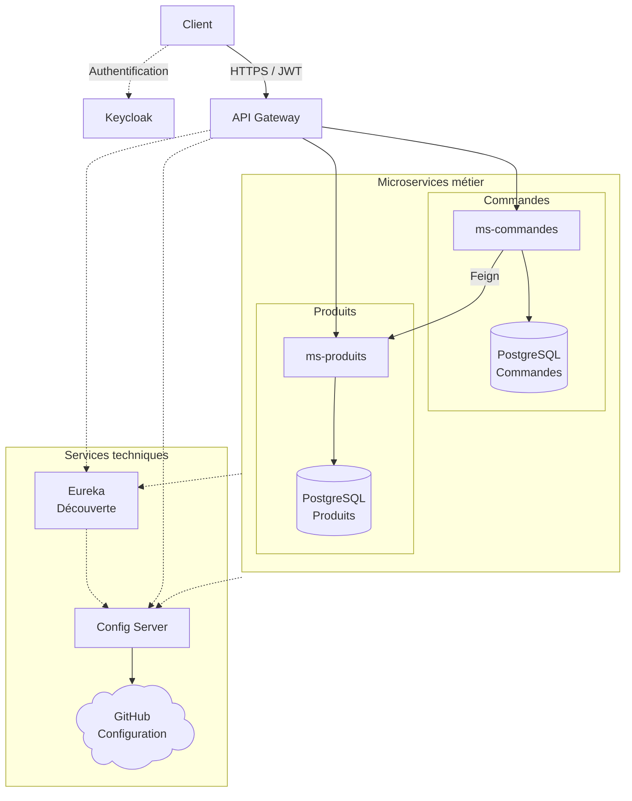

# Diagramme d'architecture — Microservices

```mermaid
flowchart TB
    Client["Client"]
    KC["Keycloak"]
    GW["API Gateway"]

    Client -->|"HTTPS / JWT"| GW
    Client -.->|"Authentification"| KC

    subgraph METIER ["Microservices métier"]
        subgraph COMMANDES ["Commandes"]
            MC["ms-commandes"]
            DBC[("PostgreSQL<br/>Commandes")]
            MC --> DBC
        end

        subgraph PRODUITS ["Produits"]
            MP["ms-produits"]
            DBP[("PostgreSQL<br/>Produits")]
            MP --> DBP
        end

        MC -->|"Feign"| MP
    end

    GW --> MC
    GW --> MP

    subgraph INFRA ["Services techniques"]
        EUR["Eureka<br/>Découverte"]
        CFG["Config Server"]
        GIT@{ shape: cloud, label: "GitHub<br/>Configuration" }
        EUR -.-> CFG
        CFG --> GIT
    end

    METIER -.-> EUR
    METIER -.-> CFG
    GW -.-> EUR
    GW -.-> CFG
```
