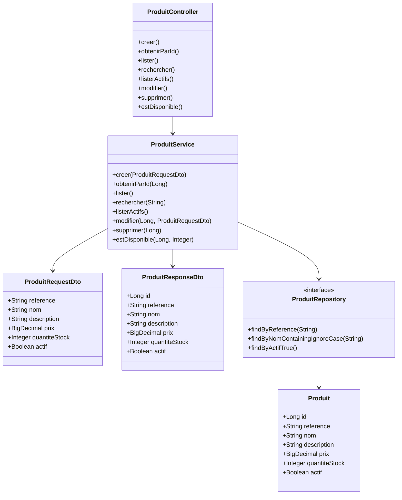

# Diagramme de classes — ms-produits

```mermaid
classDiagram
    class Produit {
        +Long id
        +String reference
        +String nom
        +String description
        +BigDecimal prix
        +Integer quantiteStock
        +Boolean actif
    }

    class ProduitRequestDto {
        +String reference
        +String nom
        +String description
        +BigDecimal prix
        +Integer quantiteStock
        +Boolean actif
    }

    class ProduitResponseDto {
        +Long id
        +String reference
        +String nom
        +String description
        +BigDecimal prix
        +Integer quantiteStock
        +Boolean actif
    }

    class ProduitRepository {
        <<interface>>
        +findByReference(String)
        +findByNomContainingIgnoreCase(String)
        +findByActifTrue()
    }

    class ProduitService {
        +creer(ProduitRequestDto)
        +obtenirParId(Long)
        +lister()
        +rechercher(String)
        +listerActifs()
        +modifier(Long, ProduitRequestDto)
        +supprimer(Long)
        +estDisponible(Long, Integer)
    }

    class ProduitController {
        +creer()
        +obtenirParId()
        +lister()
        +rechercher()
        +listerActifs()
        +modifier()
        +supprimer()
        +estDisponible()
    }

    ProduitController --> ProduitService
    ProduitService --> ProduitRepository
    ProduitRepository --> Produit
    ProduitService --> ProduitRequestDto
    ProduitService --> ProduitResponseDto
```
