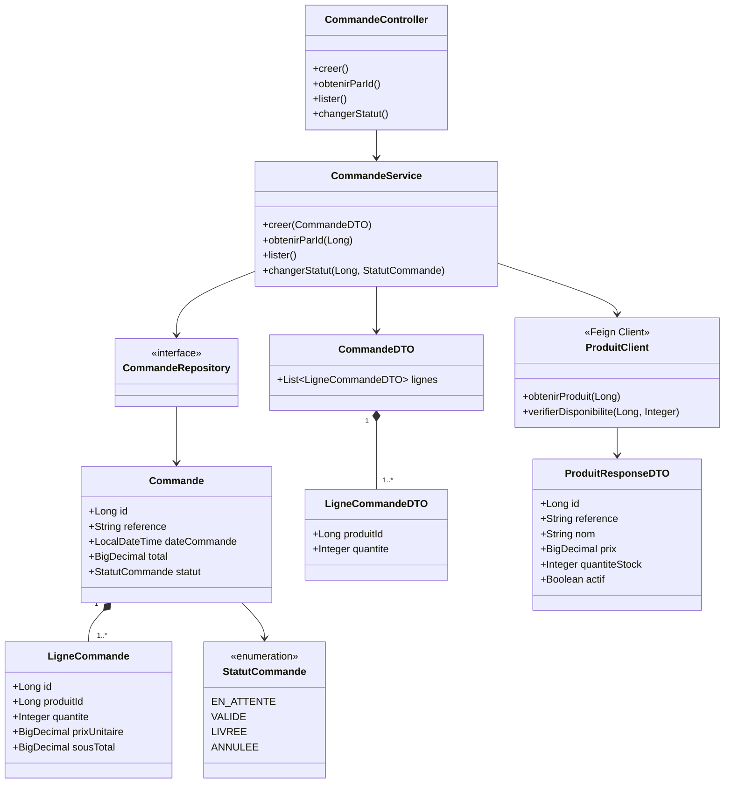

# Diagramme de classes — ms-commandes

```mermaid
classDiagram
    class Commande {
        +Long id
        +String reference
        +LocalDateTime dateCommande
        +BigDecimal total
        +StatutCommande statut
    }

    class LigneCommande {
        +Long id
        +Long produitId
        +Integer quantite
        +BigDecimal prixUnitaire
        +BigDecimal sousTotal
    }

    class CommandeDTO {
        +List~LigneCommandeDTO~ lignes
    }

    class LigneCommandeDTO {
        +Long produitId
        +Integer quantite
    }

    class ProduitResponseDTO {
        +Long id
        +String reference
        +String nom
        +BigDecimal prix
        +Integer quantiteStock
        +Boolean actif
    }

    class ProduitClient {
        <<Feign Client>>
        +obtenirProduit(Long)
        +verifierDisponibilite(Long, Integer)
    }

    class CommandeService {
        +creer(CommandeDTO)
        +obtenirParId(Long)
        +lister()
        +changerStatut(Long, StatutCommande)
    }

    class CommandeController {
        +creer()
        +obtenirParId()
        +lister()
        +changerStatut()
    }

    class CommandeRepository {
        <<interface>>
    }

    class StatutCommande {
        <<enumeration>>
        EN_ATTENTE
        VALIDE
        LIVREE
        ANNULEE
    }

    Commande "1" *-- "1..*" LigneCommande
    Commande --> StatutCommande
    CommandeController --> CommandeService
    CommandeService --> CommandeRepository
    CommandeService --> ProduitClient
    CommandeService --> CommandeDTO
    CommandeDTO "1" *-- "1..*" LigneCommandeDTO
    ProduitClient --> ProduitResponseDTO
    CommandeRepository --> Commande
```
