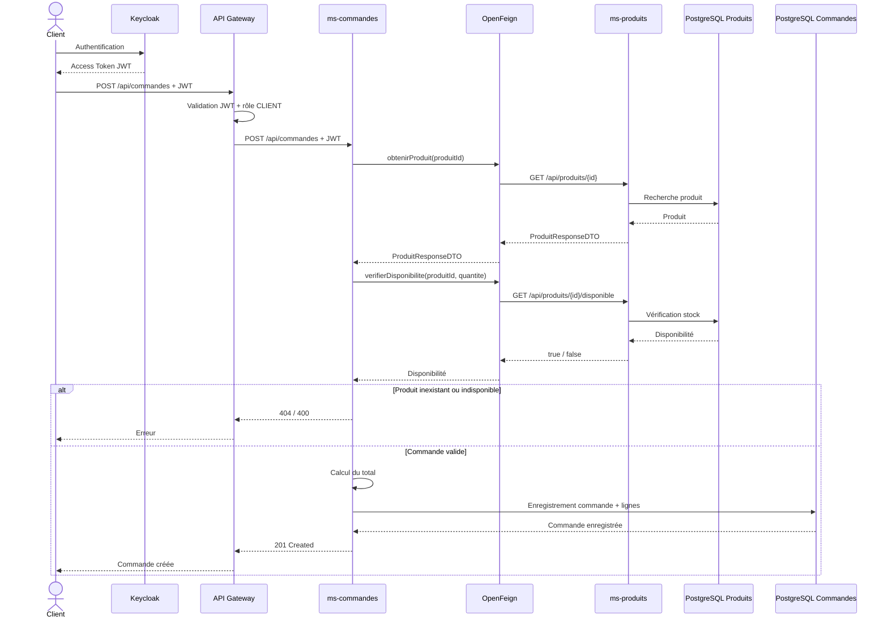

# Diagramme de séquence — Création d'une commande

```mermaid
sequenceDiagram
    actor Client
    participant KC as Keycloak
    participant GW as API Gateway
    participant MC as ms-commandes
    participant Feign as OpenFeign
    participant MP as ms-produits
    participant DBP as PostgreSQL Produits
    participant DBC as PostgreSQL Commandes

    Client->>KC: Authentification
    KC-->>Client: Access Token JWT

    Client->>GW: POST /api/commandes + JWT
    GW->>GW: Validation JWT + rôle CLIENT
    GW->>MC: POST /api/commandes + JWT

    MC->>Feign: obtenirProduit(produitId)
    Feign->>MP: GET /api/produits/{id}
    MP->>DBP: Recherche produit
    DBP-->>MP: Produit
    MP-->>Feign: ProduitResponseDTO
    Feign-->>MC: ProduitResponseDTO

    MC->>Feign: verifierDisponibilite(produitId, quantite)
    Feign->>MP: GET /api/produits/{id}/disponible
    MP->>DBP: Vérification stock
    DBP-->>MP: Disponibilité
    MP-->>Feign: true / false
    Feign-->>MC: Disponibilité

    alt Produit inexistant ou indisponible
        MC-->>GW: 404 / 400
        GW-->>Client: Erreur
    else Commande valide
        MC->>MC: Calcul du total
        MC->>DBC: Enregistrement commande + lignes
        DBC-->>MC: Commande enregistrée
        MC-->>GW: 201 Created
        GW-->>Client: Commande créée
    end
```
